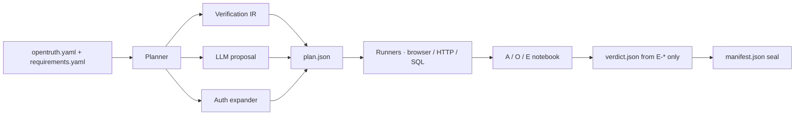

<p align="center">
  
</p>

<h1 align="center">OpenTruth</h1>

<p align="center">
  <strong>Independent verification protocol.</strong><br/>
  Did the <em>running system</em> actually satisfy the requirement?
</p>

<p align="center">
  <a href="https://github.com/dhruvshah464/OpenTruth/actions/workflows/opentruth.yml"></a>
  <a href="https://github.com/dhruvshah464/OpenTruth/releases/tag/v0.1.0-m1"></a>
  <a href="LICENSE"></a>
  
  
</p>

<p align="center">
  <code>PROVEN</code> · <code>PARTIALLY_PROVEN</code> · <code>FAILED</code> · <code>NOT_PROVEN</code> · <code>INCONCLUSIVE</code>
</p>

---

OpenTruth is the **verifier, never the builder**. It starts the application you declare, operates it (browser, HTTP, or durable state), records a hash-sealed evidence graph, and returns a verdict. AI-built software is the urgent case. The protocol still applies when the builder is human.

It does **not** write tests into the target repository. It does **not** run the builder’s tests and stamp `PROVEN`. A coding agent may only [prepare declarations](prompts/prepare-for-opentruth.md). OpenTruth runs **outside** that agent.

```
PROVEN  =  required coverage executed
        +  required assertions established
        +  evidence chain intact
        +  seal / hash valid
```

**Verifier ≠ Builder.** The planner can change; the notebook machinery does not.

| You declare | OpenTruth decides |
|---|---|
| What “done” means (`requirements.yaml`) | Whether the running system satisfied it |
| Where the app is (`opentruth.yaml`) | Independent actions, observations, assertions |
| Optional Verification IR | `verdict.json` from **E-*** only — never a model’s last sentence |

## Contents

- [Roadmap](#roadmap)
- [First five minutes](#first-five-minutes)
- [GitHub Action](#github-action)
- [CLI](#cli)
- [Verdicts](#verdicts)
- [Closed loop](#closed-loop)
- [Declare an application](#declare-an-application)
- [Fixtures](#fixtures)
- [Evidence](#evidence)
- [Protocol laws](#protocol-laws)
- [What this is not](#what-this-is-not)
- [Status](#status)

## Roadmap

| Version | Proof | Status |
|---|---|---|
| **v0.1** | MiniAuth proves falsifiability | Done · tag [`v0.1.0-m1`](https://github.com/dhruvshah464/OpenTruth/releases/tag/v0.1.0-m1) |
| **v0.2** | Verification IR proves the planner can be separated | Done |
| **v0.3** | MiniTodos proves IR works outside authentication | This gate |
| **v0.4** | Builder interoperability / preparation | Not started |
| **v0.5** | Local remote-URL verification | Not started |

The planner can change; the notebook machinery does not. v0.4 and v0.5 wait until this public clone reproduces the five commands below.

## First five minutes

Two applications. Same engine. MiniAuth is the original falsification proof. MiniTodos is the generic Verification IR proof — not an auth demo, and not the console.

```bash
pip install -e ".[dev]"

# 1. MiniAuth planted — session does not persist
opentruth verify --path examples/miniauth --mode api
# PARTIALLY_PROVEN  C-3 fail

# 2. MiniAuth claimed fix
opentruth verify --path examples/miniauth --mode api --persist-session
# PROVEN

# 3. MiniTodos planted — complete returns 200, done stays false
opentruth verify --path examples/minitodos --mode api
# PARTIALLY_PROVEN  C-2 fail  planner=ir

# 4. MiniTodos claimed fix
MINITODOS_PERSIST_COMPLETE=1 opentruth verify --path examples/minitodos --mode api
# PROVEN  planner=ir

# 5. Read the evidence
opentruth explain C-2 --path examples/minitodos
```

`opentruth serve` is a control surface for the same engine. Console subject is MiniAuth only. MiniTodos is CLI / IR.

## GitHub Action

CI is the same engine as the CLI. Exit **0** only if `PROVEN`. The sealed run is packed and uploaded as an artifact. This is not a hosted scanner and not a dashboard.

Pin a release for production:

```yaml
- name: OpenTruth
  uses: dhruvshah464/OpenTruth@v0.1.0-m1
  with:
    path: .
    mode: api
```

This repository dogfoods the Action against both fixtures (plants disabled so each gate is `PROVEN`). Pin `@v0.1.0-m1` for the MiniAuth freeze; `@main` includes MiniTodos IR.

```yaml
- uses: dhruvshah464/OpenTruth@v0.1.0-m1
  with:
    path: examples/miniauth
    mode: api
    persist-session: "true"
    artifact-name: opentruth-miniauth
```

Optional: a *different* model than the builder may propose `plan.json`. It cannot write `verdict.json`. Put the key on the **job**, not in the Action:

```yaml
- uses: dhruvshah464/OpenTruth@v0.1.0-m1
  with:
    path: .
    mode: api
    llm: "true"
    llm-model: not-the-builder
  env:
    OPENTRUTH_LLM_API_KEY: ${{ secrets.OPENTRUTH_LLM_API_KEY }}
```

If the key is missing, the model is down, or the proposal fails the allowlist, verify still seals: planner stays `deterministic` and `llm_error` is recorded on `plan.json`.

### Inputs

| Input | Default | Description |
|---|---|---|
| `path` | `.` | Directory with `opentruth.yaml` and `requirements.yaml` |
| `mode` | `api` | `browser` · `api` · `state` |
| `persist-session` | `false` | MiniAuth fixture: disable the session plant |
| `write-identity` | `false` | MiniAuth fixture: write the identity row |
| `artifact-name` | `opentruth-run` | Actions artifact name for the packed zip |
| `python-version` | `3.12` | Python used to install OpenTruth |
| `llm` | `false` | Propose `plan.json` only (never the verdict) |
| `llm-model` | `""` | Chat model. Prefer a different model than the builder |
| `llm-base-url` | `""` | OpenAI-compatible base URL |

### Outputs

| Output | Description |
|---|---|
| `verdict` | `PROVEN` · `PARTIALLY_PROVEN` · `FAILED` · `NOT_PROVEN` · `INCONCLUSIVE` |
| `run-id` | Sealed run id |
| `run-dir` | Absolute path of the sealed run directory |
| `bundle` | Path of the packed zip uploaded as the artifact |

### Exit contract

| Code | When |
|---:|---|
| **0** | `PROVEN` |
| **1** | `PARTIALLY_PROVEN` · `FAILED` · `NOT_PROVEN` |
| **2** | `INCONCLUSIVE` |
| **3** | Tampered pack / `INTEGRITY FAILED` |

Required job permission: `contents: read`. Browser mode needs Playwright Chromium on the runner; API mode is the CI default.

## CLI

```bash
pip install -e ".[dev]"
playwright install chromium          # browser proof only
opentruth serve                      # http://127.0.0.1:8787 — MiniAuth console
```

The five-command loop is under [First five minutes](#first-five-minutes). Diff two sealed MiniAuth runs with `opentruth diff <planted> <fixed> --path examples/miniauth` (C-3 `IMPROVED`).

| Command | Job |
|---|---|
| `opentruth verify` | Operate the app; seal a run |
| `opentruth explain <id>` | Walk `R-*` / `C-*` / `A-*` / `O-*` / `E-*`; refuse a tampered pack |
| `opentruth diff <before> <after>` | Differential evidence citing both run ids |
| `opentruth pack` | Zip a sealed run for CI |
| `opentruth serve` | Control surface for the same engine (MiniAuth console) |

## Verdicts

| Verdict | Meaning |
|---|---|
| **PROVEN** | Required coverage executed, required assertions hold, chain intact, seal valid |
| **PARTIALLY_PROVEN** | Happy path holds; at least one constraint fails |
| **FAILED** | The required happy path was observed not to hold |
| **NOT_PROVEN** | Not enough evidence to establish the claim — **not** FAILED |
| **INCONCLUSIVE** | Could not observe (app down, timeout, invalid plan) — **not** a pass and **not** a product failure |

`NOT_PROVEN ≠ FAILED`. `INCONCLUSIVE ≠ FAILED`. Inability to look is not a product bug. Confidence = passed / conclusive assertions; `INCONCLUSIVE` is excluded from that fraction.

## Closed loop



Planner precedence is deterministic: **declared IR → `--llm` → MiniAuth `expand()`**. Declared `verification.version: 1` wins. Hostile kinds, unknown version, and unknown `C-*` are rejected. A constraint with no executable coverage is `INCONCLUSIVE` and the requirement is `NOT_PROVEN` — never silent `PROVEN`.

Six proof layers write the **same** sealed graph: browser · API · state · diff · CI · AI-assisted plan.

## Declare an application

OpenTruth reads two files. It does not reverse-engineer an unfamiliar repository.

**`opentruth.yaml`** — how to start, health, declared routes:

```yaml
start: python app.py
url: http://127.0.0.1:{port}
health: /health
api:
  routes:
    signup:
      method: POST
      path: /api/signup
```

**`requirements.yaml`** — one English requirement plus constraints. External apps that are not MiniAuth-shaped should declare Verification IR:

```yaml
requirement: "A user can create an account and sign in."
constraints:
  - statement: "A second signup with the same mailbox is refused."
verification:
  version: 1
  steps:
    - id: S-1
      constraint: C-0
      http_request:
        method: POST
        path: /api/signup
        json:
          email: "{{actor.email}}"
          password: "{{actor.password}}"
    - id: S-2
      constraint: C-0
      assert:
        check: status_equals
        expect: "201"
```

Paste [`prompts/prepare-for-opentruth.md`](prompts/prepare-for-opentruth.md) into a coding agent so it writes **declarations only**. Then run `opentruth verify` **outside** the agent. Wording: “Prepare this application for independent OpenTruth verification” — never “install OpenTruth into the app.”

MiniAuth’s default YAML omits `verification` so the v0.1 freeze stays on the auth expander. MiniTodos **must** declare IR so v0.3 cannot accidentally expand MiniAuth routes against a todo app.

## Fixtures

Both fixtures plant a real gap so the engine can say **no** as well as **yes**. Neither ships OpenTruth runtime inside the app.

| Fixture | Planner | Plant | Default | Fixed |
|---|---|---|---|---|
| [`examples/miniauth`](examples/miniauth) | deterministic expander | Session does not persist | `PARTIALLY_PROVEN` (C-3) | `--persist-session` → `PROVEN` |
| [`examples/minitodos`](examples/minitodos) | `ir` | Complete returns 200, `done` stays false | `PARTIALLY_PROVEN` (C-2) | `MINITODOS_PERSIST_COMPLETE=1` → `PROVEN` |

v0.1.0-m1 acceptance (MiniAuth API, encoded in `tests/test_m1_contract.py`): planted `PARTIALLY_PROVEN` · persist `PROVEN` · planted→fixed diff `PROVEN` with C-3 `IMPROVED`. Run ids change per clone; **outcomes do not**.

## Evidence

Every run is a sealed directory. That folder **is** the product. JSONL is append-only. `manifest.json` is written last and hashes every file. Tamper any file and `opentruth explain` reports `INTEGRITY FAILED` — the stored verdict is no longer evidence.

```
.opentruth/runs/<run-id>/
  manifest.json          # SHA-256 of everything; sealed=true
  requirements.json      # frozen R-* / C-*
  plan.json              # ir | llm | deterministic
  actions.jsonl          # A-*
  observations.jsonl     # O-*
  assertions.jsonl       # E-*  (only input to the verdict)
  screenshots/ network/ artifacts/
  verdict.json
```

A stranger can walk `R-* → C-* → A-* / O-* / E-*`. Namespaces are never reused.

## Protocol laws

Implementation follows these. They do not weaken so the product can look simpler.

1. **Verifier ≠ Builder** — never write tests into the app under judgment.
2. **Verdict ≠ model opinion** — only recorded assertions decide `PROVEN`.
3. **Evidence is inspectable** — a stranger can walk the graph.
4. **Evidence is integrity-protected** — after seal, a changed file is not evidence.
5. **Failed verification ≠ software failure** — could not look is `INCONCLUSIVE`.
6. **Inconclusive ≠ proven** — timeouts cannot pad the pass rate.
7. **Requirements are explicit** — declared YAML only; no secret repo scanning.
8. **Verdicts are reproducible** — same fixture, same flags, same words.
9. **AI may propose; machinery decides** — a model may suggest steps; the engine decides truth.
10. **Every claim points to evidence** — uncovered `C-*` cannot vanish into a pass.
11. **The planner can change; the notebook does not** — IR, LLM, and `expand()` all land in the same `plan.json`, runners, A/O/E, seal, and E-only verdict.

## What this is not

Automatic requirement discovery · unfamiliar-repo analysis · multi-agent verification · production observability dashboards · verification marketplaces · enterprise SaaS as the product · hosted URL scanning · running the builder’s tests as proof.

Local `verify --url` is a later declared target. A public scanner is refused until isolation, SSRF, credentials, and abuse are designed.

## Status

**v0.1** MiniAuth freeze tagged [`v0.1.0-m1`](https://github.com/dhruvshah464/OpenTruth/releases/tag/v0.1.0-m1) (`fd5eff4`). **v0.2** Verification IR compiles into existing `plan.json`. **v0.3** MiniTodos proves the IR is not auth-specific (`planner=ir`).

Lab write-up, working conditions, inventory, and roadmap: **[PRODUCT-REPORT.md](PRODUCT-REPORT.md)**.

Python 3.11+ · Apache-2.0 · package `opentruth` 0.1.0 · site `http://127.0.0.1:8787`

## License

[Apache License 2.0](LICENSE) · Copyright 2026 Dhruv Shah
